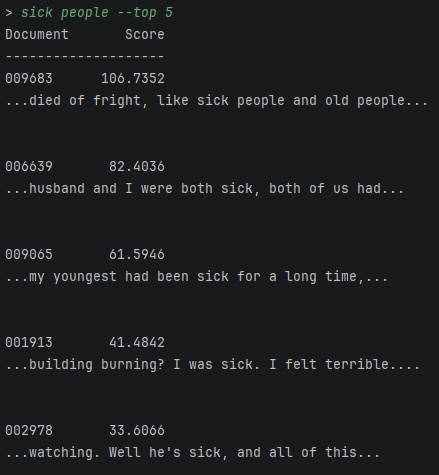

# Mini Search Engine

A Python search engine that builds an inverted index over a collection of text documents and ranks results using TF-IDF. The project includes Boolean search, top-k retrieval, result snippets, automated testing, and persistent index storage.

## Features

- **Tokenization** — Cleans text, removes punctuation, and filters common stop words.
- **Inverted index** — Maps terms to documents and stores term frequencies.
- **Boolean AND search** — Multi-term queries return documents containing all query terms.
- **TF-IDF ranking** — Ranks results based on term frequency and inverse document frequency.
- **Top-k retrieval** — Limits the number of returned results with `--top`.
- **Result snippets** — Displays relevant sections of matching documents.
- **Persistent index** — Saves the generated index to disk for faster subsequent searches.
- **Automated testing** — Tests tokenization, indexing, search, snippets, and persistence with pytest.

## Demo

Example query: 



## How It Works
```text
Documents
    ↓
Tokenization
    ↓
Inverted Index
    ↓
User Query
    ↓
Boolean Filtering
    ↓
TF-IDF Scoring
    ↓
Top-k Results
    ↓
Document Snippets
```
The inverted index maps each term to the documents containing it and its frequency in each document. Multi-term queries first filter for documents containing all query terms, then TF-IDF scores are used to rank the results.

## Dataset

The search engine was developed using the 20 Newsgroups text dataset.
The dataset is not included in this repository because of its size. Documents should be placed in:
data/documents/
## Usage

After placing the documents in data/documents/, run the search engine from the project root.

Example queries:
```text
> sick
> sick people
> sick people --top 5
```
The --top option controls the maximum number of results returned.

The first run builds and saves the inverted index. Subsequent runs load the saved index instead of rebuilding it.

## Testing

The project uses pytest for automated testing.

Run the complete test suite from the project root:

python -m pytest

The test suite covers:

- Tokenization and stop-word filtering
- Inverted-index construction
- Single- and multi-term search
- Missing and empty queries
- TF-IDF ranking
- Top-k retrieval
- Result snippets
- Index persistence

## Technologies
- Python
- pytest
- Regular expressions
- File I/O
- Inverted indexes
- TF-IDF information retrieval